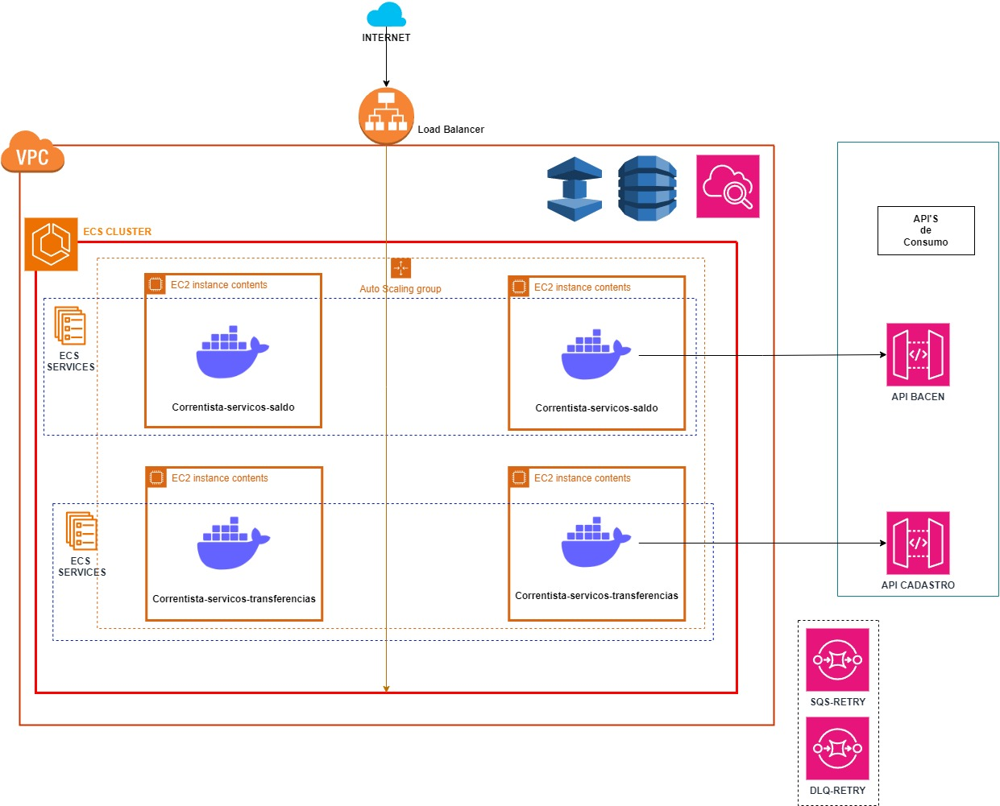
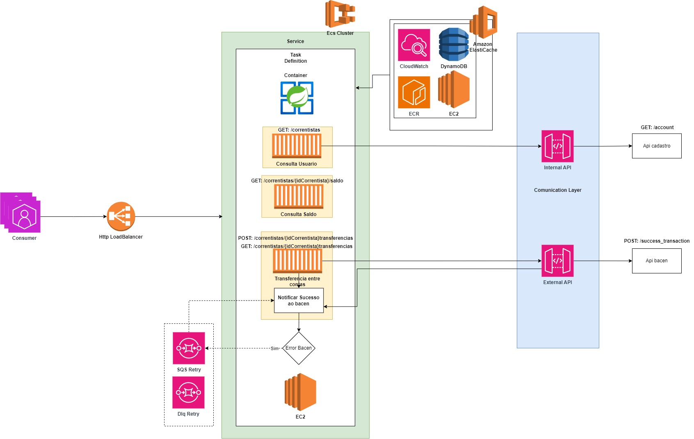

# README - Serviços de Conta Corrente

Este projeto, denominado **correntistas-servicos**, oferece serviços relacionados a contas correntes em um ambiente de desenvolvimento em Spring Boot. O objetivo é fornecer operações básicas relacionadas a correntistas e transferências entre contas correntes.
Tambem foi adicionado o consulta saldo dentro desse projeto, mas foi por conta de facilitar o uso de exemplo, mas a ideia seria separar em um outro container.

## Arquitetura


## Arquitetura Fluxo


## Compilação do Projeto

Para compilar o projeto, execute o seguinte comando na raiz do projeto:

```bash
mvn clean package
docker-compose up --build
````

## Funcionalidades

O projeto possui as seguintes funcionalidades:

1. **Consulta de Correntistas por Nome, ID de Usuário ou ID de Correntista:**
   - Os usuários podem consultar os correntistas fornecendo o nome, o ID de usuário ou o próprio ID do correntista.
   - Os correntistas são recuperados com base nas informações fornecidas.

2. **Realização de Transferências:**
   - As transferências podem ser realizadas por meio da entidade de correntista, passando o ID do correntista na URL.
   - A transferência é registrada e processada.

3. **Listagem de Transferências Realizadas:**
   - As transferências realizadas são listadas através da URL `localhost:8080/correntistas/{idCorrentista}/transferencias`.

## Estrutura do Projeto

O projeto segue a seguinte estrutura de pastas:
```plaintext
correntistas-servicos
│   
└───src
    └───main
        └───java
            └───com
                └───conta
                    └───bancaria
                        └───correntista
                            └───servicos
                                ├───controller
                                ├───dto
                                ├───exception
                                ├───model
                                ├───repository
                                └───service
```

## Uso

### Testes locais: 
#### 1 - Este projeto está em Java Springboot, para executar recomendo a IDE Intellij. 
#### 2 - É necessário ter configurado em sua maquina o Mysql.
#### 3 - Sabendo o seu usuario e senha root, altere se necessário no `main/resources/application.properties` os parâmetros: `spring.datasource.username=root` e `spring.datasource.password=root`
Para utilizar os serviços disponibilizados pelo projeto, pode-se fazer chamadas HTTP para os endpoints fornecidos. Abaixo estão os principais endpoints disponíveis:

1. **Consulta de Correntistas:**
   - Endpoint: `GET /correntistas`
   - Parâmetros:
      - `nome`: Nome do correntista
      - `idUsuario`: ID do usuário associado ao correntista
      - `idCorrentista`: ID do correntista
   - Exemplo de Uso: `localhost:8080/correntistas?nome=Ronaldo`
   - Exemplo de Uso: `localhost:8080/correntistas?idUsuario=222434531`
   - Exemplo de Uso: `localhost:8080/correntistas?idCorrentista=1`

2. **Realização de Transferências:**
   - Endpoint: `POST /correntistas/{idCorrentista}/transferencias`
     - body:
        `` {
       "idUsuarioDestino": "2",
       "valor": "30"
       }``
   - Corpo da Requisição: Detalhes da transferência
   - Exemplo de Uso: `localhost:8080/correntistas/1/transferencias`

3. **Listagem de Transferências Realizadas:**
   - Endpoint: `GET /correntistas/{idCorrentista}/transferencias`
   - Exemplo de Uso: `localhost:8080/correntistas/1/transferencias`

## Documentação Adicional

Está disponivel na pasta **/docs** a collection para executar no postman as operações. 

## Arquitetura e Serviços AWS

Este projeto foi desenvolvido considerando as melhores práticas de arquitetura e integração com serviços AWS. Abaixo estão algumas sugestões de serviços AWS que podem ser utilizados para cada requisito:

1. **Escalonamento para Oscilação de Carga:**
   - **Amazon EC2 Auto Scaling:** Os recursos de computação (instancias EC2) podem ser dimensionados automaticamente para cima ou para baixo conforme necessário.
   - **Amazon ECS:** Esse serviço permite escalar automaticamente os contêineres com base na demanda para aplicações baseadas em contêineres.

2. **Proposta de Observabilidade:**
   - **Amazon CloudWatch:** Para monitoramento dos recursos e serviço em tempo real, coletar e armazenar logs e gerar alertas com base em métricas definidas.
   - **AWS X-Ray:** Oferece dados detalhados sobre transferencias e atrasos de serviço, facilitando a identificação de pontos críticos e otimizações.

3. **Escolha da Solução de Banco de Dados:**
   - **Amazon DynamoDB:** Para um banco de dados NoSQL altamente escalável e com baixa latência.

4. **Justificativa para o Uso de Caching:**
   - **Amazon ElastiCache:** É permitido adicionar camadas de cache entre a aplicação e o banco de dados visando melhorar o desempenho e diminuir a carga no banco de dados principal.

5. **Suporte a Alto Throughput (6 miltps):**
   - Ajuste horizontalmente os recursos de computação e banco de dados conforme necessário.
   - Use Amazon SQS para separar e processar grandes quantidades de mensagens de forma assíncrona.

6,8. **Estratégia para Throttling do BACEN:**
- **SQS:** Foi colocado um SQS no fluxo a fim de simular um envio para retry em caso de erro no fluxo de envio ao BACEN.

7. **Estrategia para não impactar o cliente:**
   - Em caso de erro, apontamos o status de erro e salvamos como erro no banco de dados, não é realizado um retry automatico para nao gerar duplicidade.

Espero que este README seja útil para entender e utilizar os serviços fornecidos pelo projeto **correntistas-servicos**. 